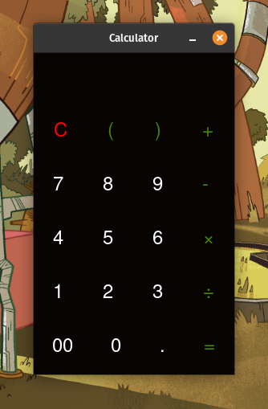
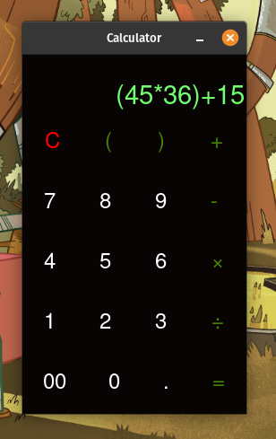

# Gui Calculator
A simple calculator made with the help of tkinter module in python.

# Getting Started
To use this calculator on your computer clone this repo with
```
git clone https://github.com/zktanvir/gui-calculator
```
then change directory 
```
cd gui-calculator
```
then run
```py
python3 main.py #or python main.py
```
and you will be able to use this calculator.

# Screen Shots



